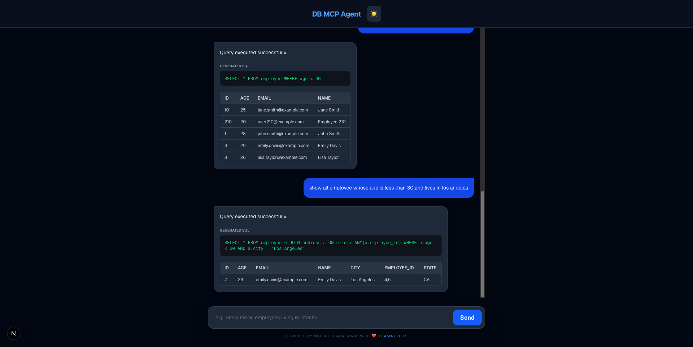

# MCP SQL - AI-Powered Database Query Interface

A full-stack application that combines AI language models with the Model Context Protocol (MCP) to enable natural language database queries. Ask questions in plain English, and the system automatically generates and executes SQL queries.

## 📋 Table of Contents

- [Project Overview](#project-overview)
- [Architecture](#architecture)
- [Technology Stack](#technology-stack)
- [Project Structure](#project-structure)
- [Getting Started](#getting-started)
- [Backend Setup](#backend-setup)
- [Frontend Setup](#frontend-setup)
- [API Documentation](#api-documentation)
- [Database Schema](#database-schema)
- [Features](#features)
- [Configuration](#configuration)
- [Security](#security)
- [Troubleshooting](#troubleshooting)

---

## 🎯 Project Overview

MCP SQL is an intelligent database interface that leverages AI to bridge the gap between natural language and SQL. Instead of writing complex SQL queries, users can simply describe what data they need, and the system intelligently:

1. **Understands** the natural language request
2. **Generates** appropriate SQL queries
3. **Validates** queries for safety and permissions
4. **Executes** queries against PostgreSQL
5. **Returns** results in a user-friendly format

---
### Screenshot




---
### Key Use Cases

- Business analysts querying data without SQL knowledge
- Rapid prototyping and data exploration
- Self-service data retrieval
- Educational tool for learning SQL through examples

---

## 🏗️ Architecture

### System Flow

```
User Request (Natural Language)
    ↓
Frontend (Next.js)
    ↓
Backend Express Server
    ↓
Ollama LLM (qwen2.5-coder)
    ↓
MCP PostgreSQL Server
    ↓
PostgreSQL Database
```

### Components

1. **Frontend**: Next.js React application for user interaction
2. **Backend**: Express.js server managing API requests and MCP communication
3. **LLM**: Ollama running qwen2.5-coder model for SQL generation
4. **Database**: PostgreSQL with MCP protocol for safe query execution
5. **MCP**: Model Context Protocol providing standardized tool interface

---

## 🛠️ Technology Stack

### Backend
- **Runtime**: Node.js with TypeScript
- **Framework**: Express.js
- **AI Model**: Ollama (qwen2.5-coder)
- **Database Protocol**: Model Context Protocol (MCP)
- **Database**: PostgreSQL

### Frontend
- **Framework**: Next.js 15+
- **UI**: React with TypeScript
- **Styling**: CSS Modules / Tailwind CSS
- **HTTP Client**: Fetch API

### Infrastructure
- **Port**: Backend on 3001, Frontend on 3000
- **CORS**: Enabled for cross-origin requests

---

## 📁 Project Structure

```
mcp sql/
├── backend/
│   ├── server.ts           # Main Express server with MCP integration
│   ├── package.json        # Backend dependencies
│   ├── tsconfig.json       # TypeScript configuration
│   └── notes               # Development notes
│
├── frontend/
│   ├── app/
│   │   ├── layout.tsx      # Root layout component
│   │   ├── page.tsx        # Main chat interface
│   │   └── globals.css     # Global styles
│   ├── public/             # Static assets
│   ├── package.json        # Frontend dependencies
│   ├── tsconfig.json       # TypeScript configuration
│   ├── next.config.ts      # Next.js configuration
│   ├── eslint.config.mjs   # ESLint rules
│   └── postcss.config.mjs  # PostCSS configuration
│
└── README.md               # This file
```

---

## 🚀 Getting Started

### Prerequisites

- **Node.js**: v18+ (with npm or yarn)
- **Python**: 3.8+ (for virtual environment, optional)
- **PostgreSQL**: 12+ running locally
- **Ollama**: Installed with qwen2.5-coder model
- **Git**: For version control

### Quick Start

1. **Clone and Navigate**
   ```bash
   cd "your folder"
   ```

2. **Configure Environment**
   ```bash
   # Backend - create .env from example
   cp backend/.env.example backend/.env
   
   # Edit backend/.env with your database credentials
   nano backend/.env  # or open in your editor
   ```

3. **Install Dependencies**
   ```bash
   # Backend
   cd backend && npm install
   
   # Frontend (in new terminal)
   cd frontend && npm install
   ```

4. **Start Backend**
   ```bash
   cd backend
   npx tsc --outDir dist   
   node dist/server.js
   # Expected output: 🚀 Backend running on http://localhost:3001
   ```

5. **Start Frontend** (in new terminal)
   ```bash
   cd frontend
   npm run dev
   # Access at http://localhost:3000

---

## 🐳 Docker (recommended)

Run the full stack (Postgres, backend, frontend) with Docker Compose. This is the easiest way to reproduce the environment used during development.

1. Build and start all services:
```bash
docker-compose up --build
```

2. The compose file exposes the services on these ports by default:
- Frontend: `http://localhost:3000`
- Backend: `http://localhost:3001`
- Postgres: `localhost:5432`

3. If you run Ollama locally (not in Compose), the backend is already configured to use your host Ollama via `host.docker.internal:11434`. If you run Ollama as a container, set `OLLAMA_URL` to the container host (service name) in `docker-compose.yml`.

4. Reinitialize DB (if you want a fresh DB): stop compose, delete the DB volume or data directory, then `docker-compose up --build` again. See the `backend/db/init.sql` script for sample data and `citext` usage.

---
   ```

---

# MCP SQL — Quick Start

Lightweight project that turns natural-language requests into safe, read-only SQL queries against PostgreSQL using an LLM (Ollama) + MCP.

Quick highlights:
- Backend: Express + TypeScript (MCP integration)
- Frontend: Next.js chat UI
- DB: PostgreSQL (sample data provided)
- LLM: Ollama (qwen2.5-coder)

---

## Quick Start (Docker)

1. Build and run:
```bash
docker-compose up --build
```

2. Open:
- Frontend: http://localhost:3000
- Backend API: http://localhost:3001

Notes:
- If Ollama runs locally, the backend uses `host.docker.internal:11434` by default.
- To reset data, remove DB volumes or re-run `docker-compose` after stopping the stack.

---

## Minimal Usage Examples (English → SQL)

Try these prompts in the frontend or via the API `/api/chat`:
- "Show me all employees and their emails."
- "List city and state for the employee named Mia."
- "How many employees are in Texas?"
- "Show employees older than 30, sorted by age desc."
- "who is the youngest employee?"

Direct SQL examples (for reference):
```sql
-- Join with array column
SELECT a.city, a.state
FROM address a
JOIN employee e ON e.id = ANY(a.employee_id)
WHERE e.name = 'Mia';

-- Case-insensitive partial match (if citext enabled)
SELECT * FROM employee WHERE name ILIKE '%mi%';
```

---

## Environment (backend/.env)

Set `DATABASE_URL`, `PORT`, and `LLM_MODEL` (default `qwen2.5-coder`). Example:
```
DATABASE_URL=postgresql://mesut:mesutpass@db:5432/springbootmicroservicesdemo
PORT=3001
LLM_MODEL=qwen2.5-coder
```

---

## Schema (summary)
- `employee(id, name, age, email)`
- `address(id, city, state, employee_id INT[])` — use `ANY` to join arrays

---